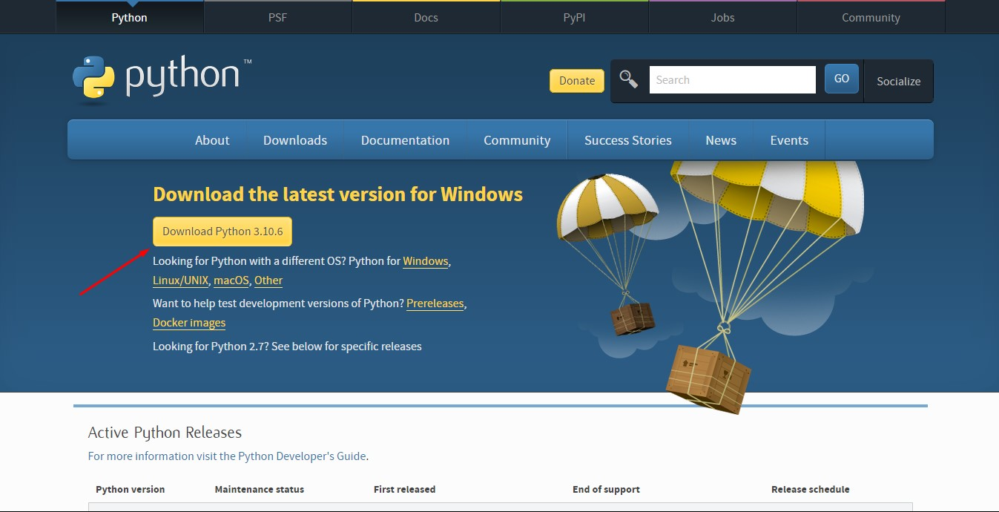
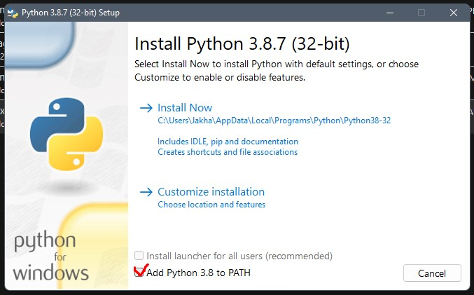
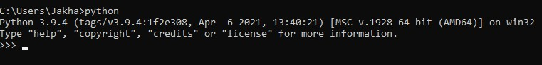

# Pyton intro

1. Заходем на [Python.org](https://www.python.org/)
2. Скачиваем Python 
3. Ставим галачку 
4. В cmd можно проверить набрав команду "Python" 
5. Устновка IDE (VS Code & PyCharm)
6. Настройка IDE
7. Запуск нашей первой программы "Hello World"